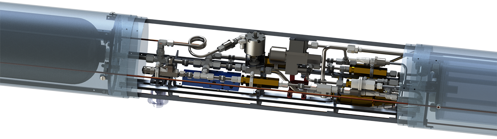

# Aerospace Engineering

## Yellow Jackets Space Program (YJSP)

As the Flight Feed System Lead, I contribute to the design, construction, and testing of the internal portion of our flight vehicle. The rocket is refered to as Subscale since it is the 1:2 scale prototype for the fullscale vehicle we're designing to cross the Kármán line (100 km).

 

## Hotfire Test at DeKalb-Peachtree Airport (PDK)

Produced and edited a video of our hotfire test which received 36,500 views on Reddit.

<h3><a href="../contact">Contact</a></h3>